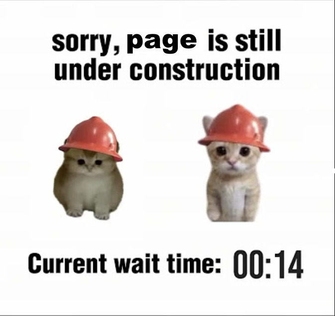

---
title:
layout: default
permalink: /projects/
published: true
---

This page is still under construction! Stay tuned...

  

<!-- 

	

  

  
  

          <a href="{{ project.redirect }}" target="_blank">
          
              <h2>{{ project.title }}</h2>
               
              
{{ project.description }}

          
          </a>
  

  

  

          <a href="{{ project.url | prepend: site.baseurl | prepend: site.url }}">
          
              <h2>{{ project.title }}</h2>
               
              
{{ project.description }}

          
          </a>
  

  

  

	

 -->
